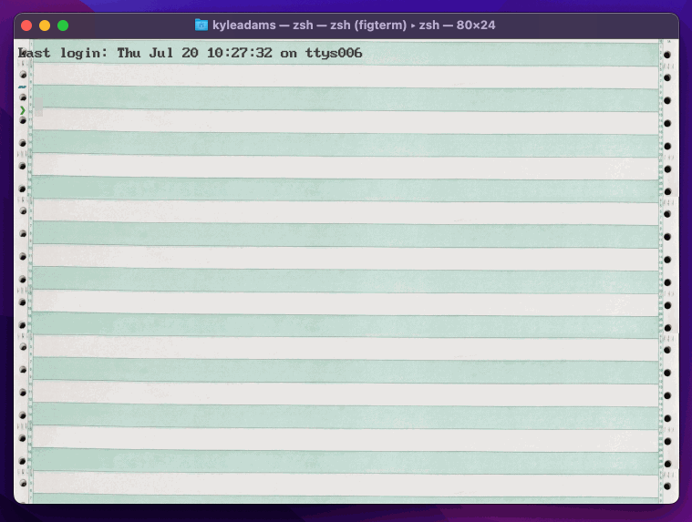

# Dot Matrix Terminal

## Installation

- Clone this repo, or download a zip and expand it
- `brew tap homebrew/cask-fonts`
- `brew install font-bigblue-terminal-nerd-font`
- Open `Terminal.app` (the built-in macOS terminal)
- From the Terminal menu, choose Settings, then Profiles
- At the bottom of the list of profiles on the left you'll see an icon that is an ellipsis in a circle. Click it and choose "Import…". Find the `Dot Matrix.terminal` file in this folder and choose "Open". The "Dot Matrix" theme should appear in the list.
- From the Shell menu, choose New Window > Dot Matrix. A new terminal should open.
- If the green-and-white-striped background does not appear, you may need to re-specify the image file:
  - Back in Settings > Profiles, click the Dot Matrix profile
  - Under Text > Background, drag `dot_matrix_background.jpg` onto the box next to "Image"
  - Close and re-open the "Dot Matrix" terminal
